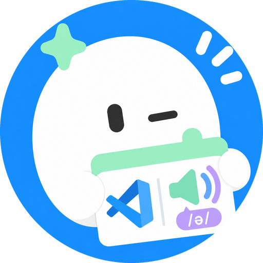
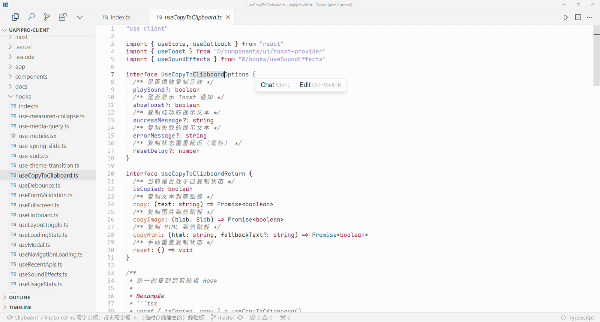
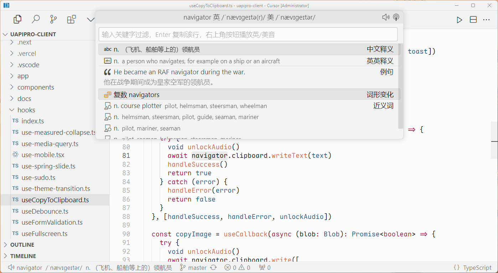

<div align="center">



# Word Speaker

Word Speaker 是一款面向开发者的 VS Code 插件。将光标放在单词上，按 `Alt+Q`，就能听到真人发音，状态栏同时显示音标和中文释义。

<a href="https://github.com/shuakami/word-speaker/releases/latest/download/word-speaker.vsix"></a>
<a href="https://shuakami.github.io/word-speaker/"></a>

</div>

## 截图

**按 `Alt+Q` 读单词。** 状态栏显示音标和释义，悬停可以查看完整词条并切换英式或美式发音。



**按 `Alt+W` 查词。** 面板里有音标、中英文释义、例句、词形变化、词组和近义词。



## 功能

- **真人发音。** 默认美式，可以在设置里改成英式，也可以在释义卡片里临时切换。
- **状态栏显示音标和释义。** 按下 `Alt+Q` 后出现，几秒后自动消失，不打断当前工作。
- **完整词条。** `Alt+W` 打开查词面板，包含例句、词形变化、词组、近义词和各类词汇分级。按回车复制所选行。
- **无感播放。** 发音在后台播放，不弹出扰人的窗口；需要时回退到 VS Code 内置播放器。
- **本地缓存。** 每个单词的发音只下载一次，之后保存在本机，重复朗读无需再次联网。

## 快捷键

| 快捷键 | 命令 | 作用 |
| --- | --- | --- |
| `Alt+Q` | `wordSpeaker.speak` | 读出光标下或选中的单词 |
| `Alt+W` | `wordSpeaker.lookup` | 打开查词面板 |
| `Alt+Shift+Q` | `wordSpeaker.repeat` | 重读上一个单词 |

## 设置

| 设置项 | 默认值 | 说明 |
| --- | --- | --- |
| `wordSpeaker.accent` | `us` | 默认口音，`uk` 为英式，`us` 为美式 |
| `wordSpeaker.showDefinition` | `true` | 读单词时是否在状态栏显示音标和释义 |
| `wordSpeaker.statusBarDuration` | `6` | 状态栏信息的显示时长，单位为秒 |
| `wordSpeaker.playbackMode` | `auto` | 播放方式：`auto` 优先系统播放器，`native` 只用系统播放器，`webview` 只用 VS Code 内置播放器 |
| `wordSpeaker.playerCommand` | 空 | 自定义播放命令，`{file}` 会被替换为 mp3 文件路径 |
| `wordSpeaker.engine` | `local` | 查词引擎，`local` 延迟更低 |

## 安装

1. 从 [Releases](https://github.com/shuakami/word-speaker/releases/latest) 下载 `word-speaker.vsix`。
2. 将 VSIX 拖入 VS Code 扩展面板，或在终端运行：

```bash
code --install-extension word-speaker.vsix
```

需要 VS Code 1.85 或更高版本。Cursor 可以用同样的方式安装。

## 开发

```bash
npm ci
npm run compile   # 编译 TypeScript
npm run package   # 打包成 .vsix
```

在 VS Code 中按 `F5` 可以启动扩展开发宿主进行调试。词典和发音数据来自 [uapis.cn](https://uapis.cn)。

## 许可

MIT
